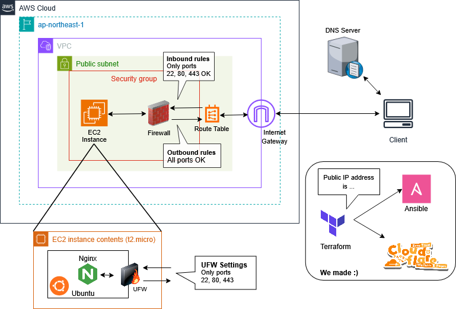

# Secure AWS Automation: Zero-Touch User Provisioning

🇯🇵 **日本語** | 🇺🇸 [English](./README.en.md)

<h3 align="center">Terraform × Ansible による AWS EC2 セキュアインフラ自動構築</h3>

<div align="center">


</div>

## 📌 概要

Terraform と Ansible を用いて、AWS EC2 のプロビジョニングからミドルウェア (Nginx) の構築までを自動化するプロジェクトです。
構築したサイトを公開しています！→ [Infrastructure Town](https://iac.samemaru.me)

## 🏗️ アーキテクチャ

Terraform と Ansible の連携により、セキュリティと自動化を両立させた AWS 環境の全体像です。



- **ネットワーク**: 公開サブネット内に配置された単一の EC2 インスタンス `(t2.micro)`。
- **セキュリティ**: AWS (セキュリティグループ) と OS (UFW) の二層防御。22 (SSH), 80 (HTTP), 443 (HTTPS) のみに通信を制限。
- **オートメーション**: Terraform が生成するインベントリファイルを Ansible が読み込むことで、**ユーザの手を介さない「ゼロタッチ」なプロビジョニング**を実現。
- **SSL / DNS**: Cloudflare による DNS 管理と、Let's Encrypt による証明書自動更新。

## 🎬 デモ

https://github.com/user-attachments/assets/93c038e3-7685-4ac3-9ad0-38d9c5b2f0b2

## 🌟 このプロジェクトの特徴

このリポジトリは「 AWS にサーバを立てる」だけでなく、**再現性・安全性・運用性**まで含めて設計した、実践志向の IaC プロジェクトです。

- **ゼロタッチで完走する構築フロー**: Terraform のリソース作成と Ansible の構成管理を連携させ、インベントリ生成から Nginx/SSL 設定までを一気通貫で自動化。
- **実運用を意識したセキュリティ設計**: AWS Security Group + UFW の二層防御、初期ユーザの無効化、管理ユーザへの安全な権限移譲までをコードで担保。
- **壊れにくいHTTPS自動化**: 証明書状態を判定して初回と再実行時の挙動を分岐し、`certonly` + テンプレート管理で冪等性と設定の一貫性を維持。
- **実装したWebページで可視化まで実施**: `web/` では Canvas ベースの3D表現で VPC / Subnet / IGW / SG / UFW / EC2 / Nginx を描画し、DNS問い合わせからレスポンス返却までの通信フローをアニメーションで確認可能。デプロイ済み環境が「本当に動いている」ことを見える形で示します。

## 🛠️ 技術スタック

- **Infrastructure as Code:** Terraform
- **Configuration Management:** Ansible
- **Cloud:** AWS EC2
- **DNS/SSL:** Cloudflare, Certbot (Let's Encrypt)
- **Target OS:** Ubuntu 22.04 LTS
- **Middleware:** Nginx
- **Web site:** JavaScript (Canvas API), HTML5, CSS3

## 📁 ディレクトリ構造

```
.
├ terraform/                      # インフラ構成 (AWS リソース)
│   ├ main.tf                     # メインロジック (リソース定義・インベントリ生成)
│   ├ variables.tf                # 変数定義 (インターフェース)
│   ├ terraform.tfvars            # 環境固有の設定値 (Git 管理対象外)
│   └ terraform.tfvars.example    # 設定値のテンプレート
├ ansible/                        # 構成管理 (ミドルウェア設定)
│   ├ ansible.cfg                 # Ansible の基本設定
│   ├ inventory/
│   │   └ hosts.yml               # Terraform により動的に生成されるインベントリ
│   ├ playbooks/
│   │   └ site.yml                # 全体制御用プレイブック
│   ├ roles/                      # 機能ごとのロール分離
│   │   ├ common/                 # ユーザ作成・セキュリティ基本設定
│   │   └ nginx/                  # Nginx 構築・SSL 証明書取得
│   └ vars/
│       └ vault.yml               # Ansible Vault による暗号化済み変数 (Git 管理対象外)
└ web/                            # 公開用 Web コンテンツ
    ├ index.html                  # メインページ
    ├ css/                        # スタイルシート
    ├ js/                         # JavaScript ファイル
    └ assets/                     # 画像・リソース類
```

## 🚀 使用方法

### ✅ 1. 前提条件

- Terraform (v1.0.0+)
- Ansible (v2.20.5+)
- AWS CLI がインストールされ、認証設定が完了していること。
    - IAM権限: 実行ユーザに `AdministratorAccess` 相当の権限が付与されていること。

<details>
<summary>AWS CLI のセットアップ手順はこちら</summary>

**1. インストール**
[公式ガイド](https://docs.aws.amazon.com/ja_jp/cli/latest/userguide/getting-started-install.html)に従いインストール。

**2. 認証設定**

```bash
aws configure
# Access Key ID, Secret Access Key, Region を入力
```

**3. 必要な権限**
IAM コンソールで、使用しているユーザに `AdministratorAccess` ポリシー、もしくは本構成に必要な権限がアタッチされていることを確認してください。

</details>

- SSH 公開鍵が `~/.ssh/id_ed25519.pub` に存在すること
- AWS IAM ユーザに `AdministratorAccess` 相当の権限が付与されていること

### 🧱 2. インフラのプロビジョニング (Terraform)

VPC, サブネット, IGW, ルートテーブル, SG 及び EC2 インスタンスの作成を行います。

**1. ディレクトリの移動**

```bash
cd terraform
```

**2. 設定ファイルの準備**

`terraform/terraform.tfvars.example` を参考に `terraform.tfvars` を作成し、自身のドメイン名及び SSH ユーザ名を記述する。

**3. 初期化**

```bash
terraform init
```

**4. 実行計画の確認**

```bash
terraform plan
```

**5. 反映**

```bash
terraform apply
```

**6. Ansibleのinventoryの自動生成・更新**

```
ansible/inventory/hosts.yml
```

**7. 接続確認**
作成したサーバへSSHでログインできるか確認する。

```bash
ssh -i ~/.ssh/id_ed25519 <terraform.tfvars で設定した ssh_user>@<Public_IP>
```

### ⚙️ 3. ミドルウェアの構築・設定 (Ansible)

Terraform で作成した EC2 インスタンスに対し、ユーザ作成, セキュリティ設定, Nginx の構築, 及び SSL 証明書の取得を自動で行います。

**1. ディレクトリの移動**

```bash
cd ../ansible
```

**2. Ansible Vaultを用いた個人情報の記述**
Ansible 使用する秘匿変数のテンプレートを用意しています。

- **Step1**: テンプレートのコピー

```bash
cp vars/vault.yml.example vars/vault.yml
```

- **Step 2**: `vars/vault.yml` を編集し、必要な値を入力する。

- **Step 3**: ファイルを暗号化する。

```bash
ansible-vault encrypt vars/vault.yml
```

**3. プレイブックの実行**

本プロジェクトは、セキュリティ向上のため「初期ユーザでのセットアップ」と「運用ユーザでの構成管理」の2フェーズ構成になっています。

```bash
ansible-playbook -i inventory/hosts.yml playbooks/site.yml
```

**4. 実行内容の内訳**

プレイブック (`playbooks/site.yml`) を実行することで、以下のプロセスが順次適用されます。

- **Phase 1: Bootstrap**
    - 管理用ユーザの作成とsudo権限付与。
    - 公開鍵認証の設定。
    - デフォルトユーザのログイン禁止設定(nologin) 及びSSH接続制限。
- **Phase 2: Main Setup**
    - Nginx のインストールと基本設定。
    - ファイアウォール (UFW) の有効化 (22, 80, 443 ポートの開放) 。
    - certbotによるSSL証明書の自動取得とHTTPS設定の反映。

**5. 構築完了の確認**

ブラウザで以下の URL にアクセスし、HTTPS 化 (鍵マーク) されたインデックスページが表示されることを確認する。

```bash
https://samemaru.me
```

### 🧹 4. 環境破壊

不要になったリソースを削除して課金を停止する。

```bash
cd ../terraform
terraform destroy
```

## 💡 工夫点

単なる自動構築に留まらず、実務レベルのセキュリティと運用性を考慮した設計を行いました。

- **Multi-Play による「ゼロ・タッチ構築」の実現**
    - 初期構築用ユーザ (ubuntu) から運用ユーザ (samemaru) への権限委譲を、Ansible のプレイを分けることで自動化。
    - SSH設定変更による「自分自身の締め出し」を防ぎつつ、構築完了と同時に初期ユーザを無効化 (nologin) する安全なプロビジョニングフローを確立。
- **冪等性を担保した SSL/HTTPS 自動化ロジック**
    - `stat`モジュールを用いて証明書の有無を事前に検知し、Jinja2 テンプレートによる条件分岐で「初回 HTTP 起動」と「2回目以降の HTTPS 起動」を動的に切り替え。
    - `meta: flush_handlers` を活用し、Certbot の認証に必要な Web サーバーの起動を待機させる確実なタスク順序を設計。
- **ハイブリッドな SSL 管理**
    - Certbot の自動設定に頼らず、`certonly` モードで証明書取得に専念させることで、Ansible による設定ファイル (Jinja2) の管理の完全性を維持。

## 🧩 苦労した点と解決策

- **SSH 接続の永続性と権限昇格の競合**
    - **課題**: SSH 制限 (AllowUsers) を適用した瞬間に、実行中の Ansible セッションが拒否される問題が発生。
    - **解決**: Ansible は1つのプレイ内で接続を維持しようとする性質を理解し、プレイを2段階 (Bootstrap と Main) に分離。
      接続ユーザを切り替えてログインし直す構成に修正。
- **Let's Encrypt のレート制限への対応**
    - **課題**: 開発中の頻繁な `terraform destroy/apply` により、同一ドメインの発行上限 (週5回) に達した。
    - **解決**: `--staging` フラグを用いたテスト発行への切り替えや、証明書取得後に `stat` で変数を再更新 (Register) して最新の状態を反映させるロジックを追加。
- **インフラ再構築時のSSHホストキー不一致**
    - **課題**: インスタンスを作り直すたびに「REMOTE HOST IDENTIFICATION HAS CHANGED」エラーが発生。
    - **解決**: `ssh-keygen -R` による既知のホスト情報の削除をフローに組み込み、開発効率を改善。

## 🚧 今後の実装予定

- **CI/CDパイプラインの強化**: Terraform fmt/validate/plan, Ansible lint/syntax-check を GitHub Actions で自動化し、レビュー前に品質ゲートを通過させる。
- **観測性 (Observability) の追加**: Nginx/OS メトリクスとログ可視化を導入し、デプロイ後の状態確認を「画面表示」だけでなく数値とログでも判断可能にする。
- **環境分離と再利用性の向上**: dev/stg/prod の変数分離と Terraform モジュール化を進め、同一設計を安全に横展開できる構成へ発展させる。
- **障害対応力の向上**: バックアップ方針とロールバック手順をコード化し、再構築だけでなく復旧時間短縮 (RTO意識) まで含めた運用設計にする。

## 📄 ライセンス

本プロジェクトは[ MIT ライセンス](./LICENSE)の下で公開されています。

### 📜 ライセンス・クレジット

[アーキテクチャ](#-アーキテクチャ)セクションで使用したツールとロゴ画像のリンクです。

- [draw.io](https://app.diagrams.net/)
- **Nginx**, **Terraform**: [ICONS8](https://icons8.jp/icon/t2x6DtCn5Zzx/nginx)
- **Cloudflare**: [KawaiiLogos by SAWARATSUKI](https://github.com/SAWARATSUKI/KawaiiLogos/blob/main/Cloudflare/png/Cloudflare.png)
